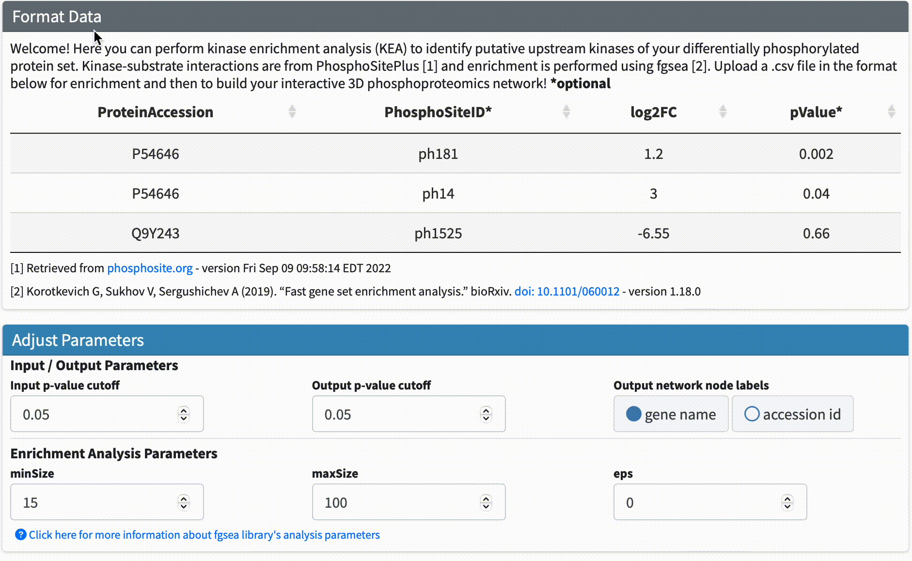
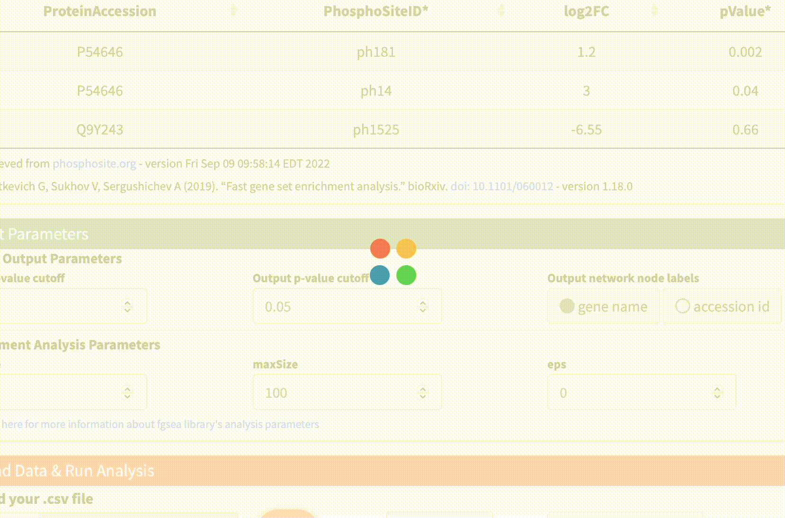
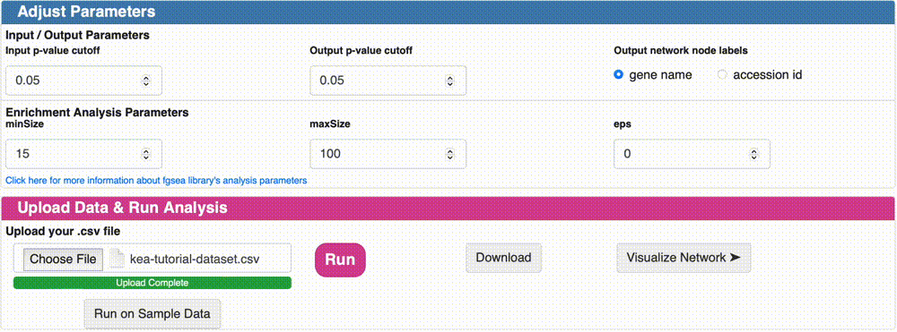

# Kinase Enrichment Analysis

The Kinase Enrichment Analysis (KEA) tool is an essential part of the PhosphoNetVis platform, allowing users to analyze their phosphoproteomic datasets and identify potential kinase targets. This step-by-step tutorial will guide you through the process of running a KEA analysis on your own data, starting from the download of the necessary file to the creation of a Kinase-Substrate Interaction (KSI) network. No prior knowledge of the KEA tool is required, as we will provide all the necessary information to successfully complete the tutorial. **Let's get started!**

***

### Step #1
**Download the dataset file for analysis:** The first step is to download a dataset that is in the correct format file for analysis. You can use the example file provided by clicking on the "Download Sample Data" link below.

<a href="../../assets/tutorial-datasets/kea-tutorial-dataset.csv" download="kea-tutorial-dataset.csv"> ⬇️ Download Sample Data</a>

***

### Step #2
**Data Format & Parameters:** Before running the analysis, take a look at the required data format and customizable parameters listed on the KEA page. If you hover over each parameter, a tooltip will appear that describes its function. **For this tutorial, we won't be changing any of the parameters.**

***

### Step #3

**Upload Data & Run Analysis:** After you have the dataset file, navigate to the "Upload Data & Run Analysis" section on the KEA page. Click on the "Browse" button and select the file you downloaded in step 1. Then click on the "Run" button to start the analysis.

***

### Step #4

**Check Analysis Status:** The analysis may take some time to complete depending on the size of the dataset file. You can check the status of the analysis on the same page. Once the analysis is complete, a message will appear on the page indicating that the network has been created successfully.

***

### Step #5

**Download KSI Network:** Click on the "Download" button to download the KSI network file that was generated as a result of the analysis, and examine the file. This file will be used to visualize the network. Note that the visualization of this network will be shown in the next tutorial.

***
## Final Words

That's it! With this tutorial, you should now be able to run a KEA analysis on your own dataset file and built your KSI network! The next tutorial will cover how to customize, upload and visualize your KSI network using PhosPhoNetVis.  <a href="https://gumuslab.github.io/phosnetvis-docs/docs/tutorials/visualization.html"> ➡️ Tutorial 2 - Customization & Visualization </a>
