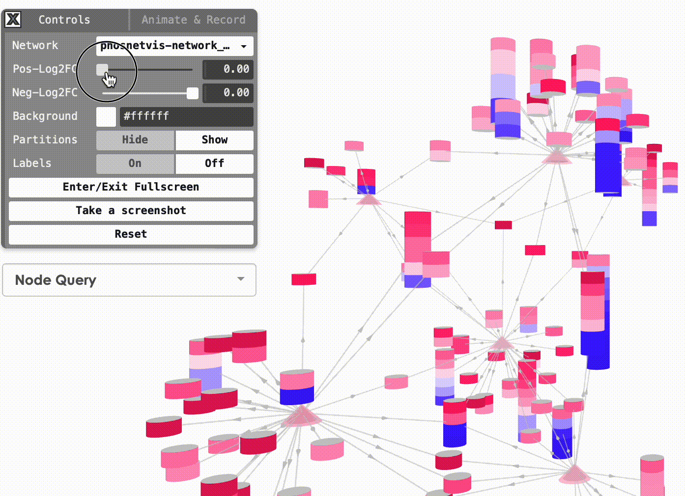
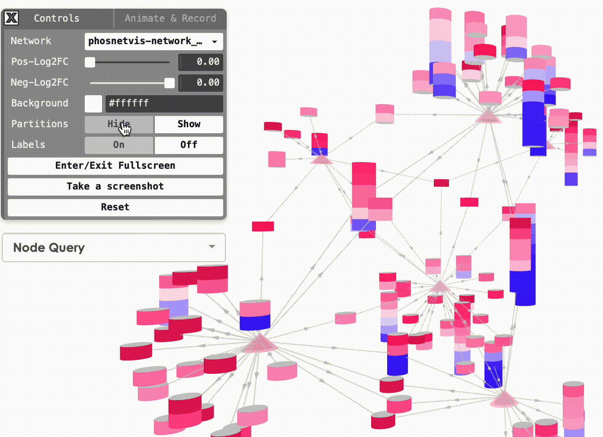

# Network Controls

Welcome to the third tutorial of PhosNetVis, where we will learn how to control and modify network visualizations. In this tutorial, we will cover various features that allow users to customize their network visualization as per their requirements. **Let's get started!**

***

### Step #1

**Modify Node Color Thresholds:** In the Network Control Panel, you can modify the thresholds for node coloring. Select a phosphorylation level threshold and a fold change threshold to control how nodes are colored. To modify the thresholds, simply use the slider bars provided.

***

### Step #2

**Change Background Color:** You can also change the background color of the network visualization. To do this, click on the "Background Color" button and select the desired color from the color picker.

***

### Step #3

**Show/Hide Partitions & Labels:** To show or hide the phosphorylation site partitions and the labels on nodes, simply click on the buttons to turn them on or off.

***

### Step #4

**Fullscreen & Screenshot & Reset:** To enter or exit fullscreen mode, take a screenshot of the network visualization, and reset the network visualization to its default settings simply click on the corresponding buttons.

***

### Step #5

**Query Node Information:** To query information about a specific node in the network, click on the "Node Query" dropdown list, then search and select the node of interest. The node's type and phosphorylation information will be displayed in a popup window while the node will also be highlighted.

***
## Final Words

That's it! With this tutorial, you should now be able to control and modify your network visualizations in PhosNetVis. In the next tutorial, we will visualize multiple networks from different timepoints, and animate then to see how phosphorylation changes! <a href="https://gumuslab.github.io/phosnetvis-docs/docs/tutorials/animation.html"> ➡️ Tutorial 4 - Multiple Networks & Animation</a>

