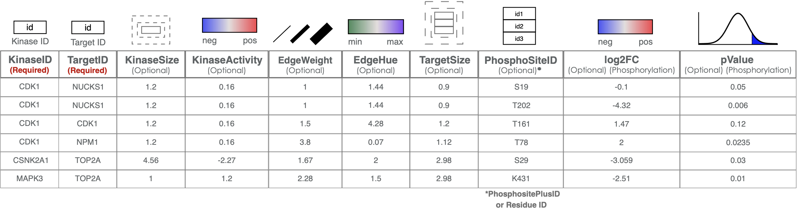

# Customization & Visualization

In this tutorial, we will explore how to customize and visualize the output of Kinase Enrichment Analysis (KEA) using PhosNetVis. KEA is a tool that allows you to identify kinases that are likely to be responsible for the observed phosphorylation patterns in a given dataset. Once the KEA analysis is complete, you can customize the output network by adding additional columns of data. After customization, you can upload the network files to PhosNetVis for 3D visualization. PhosNetVis provides interactive features for exploring the network, such as rotating, zooming, panning, and viewing node information. By the end of this tutorial, you will be able to customize and visualize the output of KEA analysis for better exploration and analysis of the network. **Let's get started!**

***

### Step #1

**Customize the network:** The output file of KEA analysis, or a network file in a correct format can be customized by adding additional columns according to the guide table provided below, using a spreadsheet software or by custom scripts on R & Python. The guide table will show what kind of data can be added to built or customize a network for specific needs.

**Important Note:**{: .label .label-red } In the following steps, we will be using the customized version of the network generated on<a href="/docs/tutorials/KEA.html"> Tutorial 1 - Kinase Enrichment Analysis</a>, where edges are randomly colored by adding *EdgeColor* column to the network. <a href="../../assets/tutorial-datasets/customized-network.csv" download="customized-network.csv"> ⬇️ Download Customized Network</a>

***

### Step #2

**Upload Networks for Visualization:** In the next step, you will need to upload the network files for visualization. Enter the number of networks you want to visualize and select these files. After selecting them, click on the "Upload" button to start the visualization process.

***

### Step #3

**Explore the Network in 3D:** Once the networks have been uploaded, they will be visualized using PhosNetVis in 3D. Use Left-click to rotate the network, Mouse-wheel to zoom, Right-click to pan, Double-click on a node to see node information, and Double-click on the background to reset the view.

***
## Final Words

That's it! With this tutorial, you should now be able to customize and visualize the output of KEA analysis for better exploration and analysis of the network. In the next tutorial, we will change use network controls to change background color, node shapes and colors, labels and run a node query to search for a protein of interest!  <a href=""> ➡️ Tutorial 3 - Network Controls</a>

